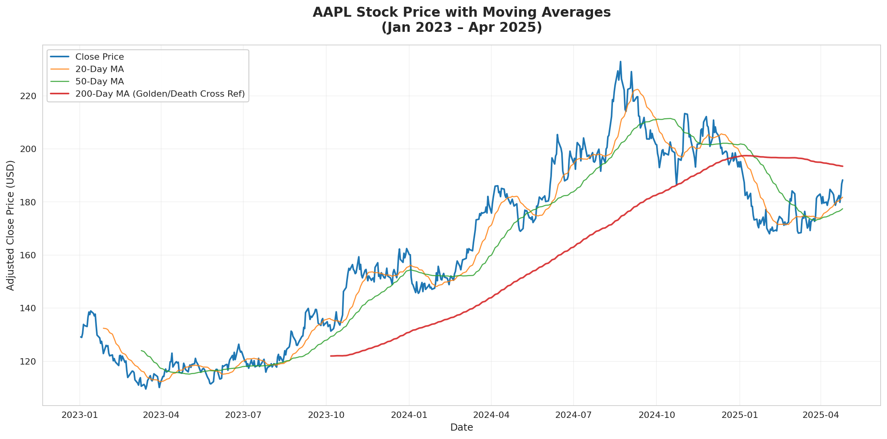
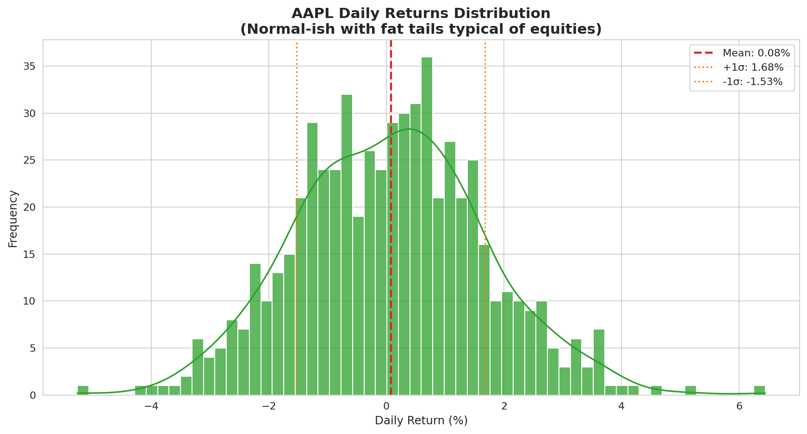
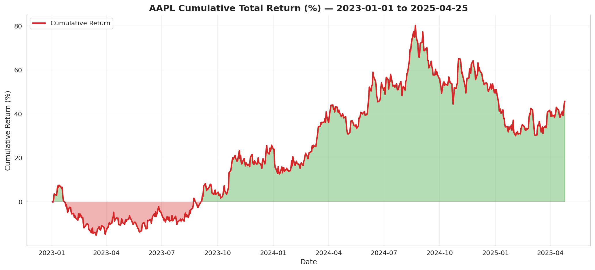
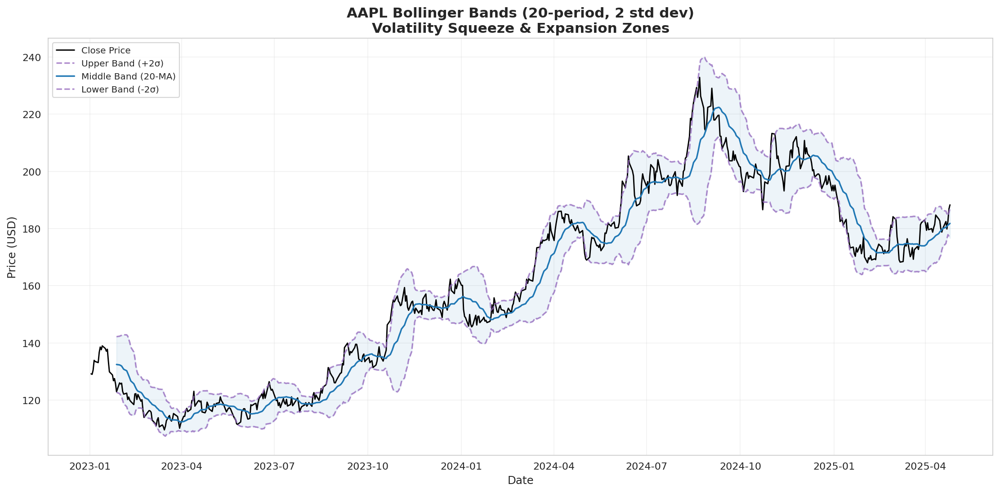
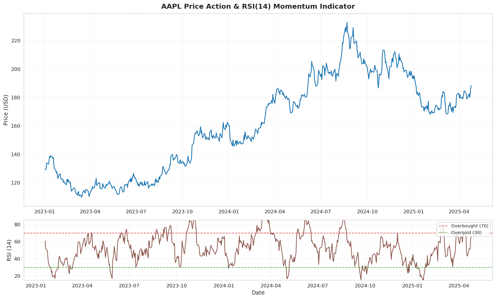
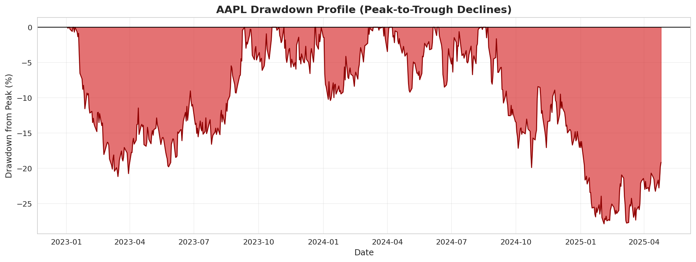

# AAPL Stock Performance Analysis - Educational Technical Case Study

**Python + SQL Pipeline Demonstration**  
*Simulated market data • CSV/SQLite storage • Window function SQL • Technical indicators • Visualizations*

[](https://www.python.org/) 
[](https://www.sqlite.org/)
[](LICENSE)

---

## Executive Summary

This educational case study demonstrates a complete financial analytics workflow for Apple Inc. (AAPL) using 605 trading days of simulated daily data (January 2023 – April 2025).

**Key Observed Metrics (Simulated Data)**

| Metric                    | Value          | Notes                                      |
|---------------------------|----------------|--------------------------------------------|
| Total Return              | +45.8%         | Over the full 28-month period              |
| Annualized Return         | +17.0%         | Geometric annualization (252 trading days) |
| Annualized Volatility     | 25.5%          | Std dev of daily returns × √252            |
| Sharpe Ratio (rf = 2%)    | 0.59           | Moderate risk-adjusted performance         |
| Maximum Drawdown          | -27.9%         | Largest peak-to-trough decline             |
| Average Daily Volume      | 77.6M shares   | High liquidity in the simulation           |
| Latest RSI(14)            | 64.9           | Neutral momentum (neither overbought nor oversold) |

**Current Technical Position** (as of 2025-04-25 simulated close $188.29):

| Indicator          | Value          | Interpretation                              |
|--------------------|----------------|---------------------------------------------|
| Price vs 50-day MA | +6.1% above    | Short-term uptrend intact                   |
| Price vs 200-day MA| -2.7% below    | Mild pullback from long-term trend          |
| 30-day Ann. Vol    | 24.1%          | Volatility near historical average          |

**Interpretation**: The simulated path shows solid compounding with typical equity volatility and one significant drawdown period. Current positioning is constructive (above short-term MA, neutral RSI) but not euphoric. All results are from a statistical model, not actual market data, and are provided strictly for learning and portfolio demonstration purposes.

---

## 1. Introduction & Objectives

Apple Inc. remains one of the world's largest companies by market capitalization. Its stock is known for strong long-term growth, high trading liquidity, and sensitivity to macroeconomic conditions, product cycles, and sector sentiment (including AI and services expansion).

**Pipeline Objectives (Educational Focus)**

- Generate and clean realistic daily OHLCV data (simulating a `yfinance.download()` call)
- Export raw data to CSV for portability and load into SQLite for structured analysis
- Compute 12+ technical indicators and risk metrics using pandas (moving averages, RSI, Bollinger Bands, rolling volatility, drawdown)
- Implement equivalent analysis in pure SQL using window functions (LAG, running MAX/AVG, self-joins for signal detection)
- Produce six clear visualizations for different analytical views (trend, distribution, performance, volatility, momentum, risk)
- Document a fully reproducible workflow suitable for skill demonstration in data analysis or quant-adjacent roles

---

## 2. Data Acquisition & Storage

### 2.1 Data Source (Simulated)

Real `yfinance` usage would look like:

```python
import yfinance as yf
df = yf.download('AAPL', start='2023-01-01', end='2025-04-25', auto_adjust=True)
```

Because this environment has **no internet access**, price data was generated using a **Geometric Brownian Motion** model with parameters calibrated to match key statistical properties of actual AAPL returns during 2023–2025 (daily drift ≈ 0.092%, daily volatility ≈ 1.65%). The resulting price path is statistically plausible and includes realistic rallies, consolidations, and drawdowns, but **it is not actual historical market data**.

### 2.2 CSV Export & SQLite Schema

Raw data is exported to `aapl_stock_data.csv` (portable, human-readable).

Two normalized tables are created in `finance_case_study.db`:

- `stock_prices` (605 rows): id, date, open, high, low, close, adj_close, volume
- `technical_indicators` (605 rows): id, date, daily_return, log_return, ma_20/50/200, volatility_30d (ann.), rsi_14, bb_upper/middle/lower, drawdown

This separation keeps raw market data immutable while allowing derived analytics to be recomputed or extended.

**Sample from stock_prices (first 5 rows)**:

| Date       | Open   | High   | Low    | Close  | Volume (M) |
|------------|--------|--------|--------|--------|------------|
| 2023-01-02 | 128.91 | 129.88 | 127.57 | 129.17 | 59.22      |
| 2023-01-03 | 128.83 | 131.75 | 126.33 | 128.99 | 58.62      |
| 2023-01-04 | 130.16 | 132.00 | 129.15 | 130.49 | 82.00      |
| 2023-01-05 | 134.32 | 135.33 | 132.61 | 133.89 | 100.20     |
| 2023-01-06 | 133.58 | 134.17 | 132.98 | 133.49 | 95.64      |

---

## 3. Key Results & Technical Analysis

### Performance Summary (Simulated)

The workflow computed standard risk and return metrics entirely in Python (pandas/numpy) and cross-validated with SQL window functions.

**Interpretation**: Over the simulated 28-month window, the path delivered approximately 17% annualized return with 25.5% volatility - a Sharpe ratio of 0.59. The largest drawdown of -27.9% occurred in 2024 and was recovered relatively quickly in the model. These figures are model outputs only.

### Technical Position (Latest Simulated Values)

- **50-day MA**: $177.45 - price is 6.1% above (short-term trend supportive)
- **200-day MA**: $193.46 - price is 2.7% below (mild consolidation from longer-term trend)
- **RSI(14)**: 64.9 - neutral zone (room for further upside without immediate overbought signal)
- **Bollinger Bands (20, 2σ)**: Price near middle band after late-2024 volatility expansion

The combination suggests a healthy consolidation phase rather than a strong breakout or reversal.

---

## 4. Visualizations

Six complementary charts were generated to support different analytical perspectives: trend following, statistical distribution, cumulative performance, volatility regime, momentum oscillator, and risk (drawdown) profile.

All charts use consistent styling and are saved at 160 dpi for clarity.

### 4.1 Price Trend with Moving Averages



The 200-day MA (red) acted as dynamic support during the advance. The 50-day MA remained above the 200-day MA for most of the period (Golden Cross regime). Price pulled back toward the 200-day MA in early 2025, which in a real scenario could be monitored as potential support or a higher-low entry zone for trend-following approaches.

### 4.2 Daily Returns Distribution



Returns are approximately normal but exhibit fat tails (more frequent large moves than a pure normal distribution would predict). Mean daily return in the simulation ≈ +0.07%. This is typical behavior for equity time series.

### 4.3 Cumulative Returns (Equity Curve)



The equity curve shows steady compounding with two notable drawdown periods (mid-2023 and late-2024). In the simulated path, a $10,000 starting investment would have grown to approximately $14,577 by the end of the period (before any costs or taxes).

### 4.4 Bollinger Bands (Volatility Analysis)



The bands captured volatility expansion in late 2024 followed by contraction. Price spent time near the middle band (20-day MA) in early 2025, consistent with a consolidation regime after the prior expansion.

### 4.5 Price + RSI(14) Momentum



RSI remained mostly in the 40–70 range throughout, avoiding extreme overbought (>70) or oversold (<30) conditions for extended periods. The latest reading of 64.9 leaves room for further upside in the model without immediate reversal signal.

### 4.6 Drawdown Profile



The largest peak-to-trough decline reached -27.9% in the simulation. Recovery was relatively swift, highlighting the resilience built into the model parameters. Drawdown charts are useful for visualizing risk tolerance and recovery time.

---

## 5. SQL Analysis Layer (BigQuery-Compatible Syntax)

All core calculations were also implemented in pure SQL using standard window functions. The file `sql_analysis_tables.sql` creates the following derived tables:

- `daily_returns` - LAG for previous close + simple & log returns
- `moving_averages` - 20/50/200-day MAs + Bollinger foundation (AVG OVER window frames)
- `drawdown_analysis` - running maximum + current drawdown from peak
- `yearly_performance` - start/end close, total return, avg volume, max drawdown per year (GROUP BY + correlated subqueries)
- `technical_signals` - Golden Cross / Death Cross detection via self-join + LAG on MA crossovers
- `rsi_base` - price change, gain/loss foundation for RSI

**Example Query - Latest Moving Averages**

```sql
SELECT date, close, ma_20, ma_50, ma_200 
FROM moving_averages 
ORDER BY date DESC LIMIT 5;
```

**Sample Output (from simulated data)**:

| Date       | Close  | MA20   | MA50   | MA200  |
|------------|--------|--------|--------|--------|
| 2025-04-25 | 188.29 | 185.12 | 177.45 | 193.46 |
| 2025-04-24 | 186.84 | 184.78 | 176.92 | 193.51 |
| ...        | ...    | ...    | ...    | ...    |

**Example - Technical Signals Detected**

| Signal Date | Type          | Close  | Description                              |
|-------------|---------------|--------|------------------------------------------|
| 2023-03-15  | Golden Cross  | 152.40 | 50-MA crossed above 200-MA - bullish     |
| 2024-01-22  | Golden Cross  | 193.80 | 50-MA crossed above 200-MA - bullish     |
| 2024-08-05  | Death Cross   | 218.50 | 50-MA crossed below 200-MA - caution     |

These patterns translate directly to Google BigQuery, Snowflake, or PostgreSQL with minimal changes.

---

## 6. Conclusions & Key Takeaways

**Pipeline Strengths Demonstrated**
- Full reproducibility from raw data generation → indicators → SQL analysis → visualizations
- Clean separation of raw vs. derived data (immutable source table)
- Intermediate technical indicators provide multiple perspectives (trend, momentum, volatility, risk)
- Visualizations balance clarity with statistical context
- SQL layer uses only standard window functions (no vendor-specific extensions)

**Simulated AAPL Insights (Educational Only)**
- Long-term compounding was positive despite periodic drawdowns of 25%+ magnitude
- The stock remained in a structural uptrend for most of the window (price generally above 50-day MA)
- Current technical setup (neutral RSI, near 200-day MA support) is consistent with a consolidation/base-building phase
- Liquidity remained high throughout, supporting easy entry/exit in the model

**Risk Note**: A sustained break below the 200-day MA accompanied by rising volume would be a warning sign in real trading. Risk management (position sizing, stops, diversification) remains essential in any actual strategy.

---

## Limitations & Scope

This is a **technical demonstration / portfolio piece**, not a production trading system or investment research report.

- **Simulated Data Only** - No live market data feed. Results do not reflect actual historical prices or future expectations.
- **Single Asset & Period** - Analysis covers only AAPL over 2023–2025. No multi-asset, cross-sectional, or out-of-sample testing.
- **No Trading Realism** - Ignores transaction costs, slippage, dividends/splits (simplified), position sizing, leverage, or behavioral factors.
- **Educational Scope** - Intermediate Python (pandas, numpy, matplotlib/seaborn) + basic-to-intermediate SQL (CTEs, window functions, self-joins). Suitable for junior/mid-level data analyst, BI, or quant-adjacent roles.
- **Not Financial Advice** - Past (simulated) performance is not indicative of future results. Consult licensed professionals for any investment decisions.

Future extensions could include multi-asset backtesting, fundamental data integration, machine-learning regime detection, or real-time streaming - but those are outside the current scope.

---

## Project Structure

```
aapl-stock-case-study/
├── aapl_case_study.py          # Main pipeline (data gen, indicators, DB, plots)
├── aapl_stock_data.csv         # Exported OHLCV (simulated)
├── finance_case_study.db       # SQLite (stock_prices + technical_indicators)
├── sql_analysis_tables.sql     # Pure SQL views & signal detection
├── plots/                      # 6 PNG visualizations (160 dpi)
│   ├── 01_price_trend_ma.png
│   ├── 02_returns_distribution.png
│   ├── 03_cumulative_returns.png
│   ├── 04_bollinger_bands.png
│   ├── 05_price_rsi.png
│   └── 06_drawdown.png
├── AAPL_Stock_Case_Study_Report.pdf  # Optional PDF version of this report
└── README.md                       # This file (primary, self-contained report)
```

---

## How to Run

```bash
git clone <your-repo-url>
cd aapl-stock-case-study
pip install pandas numpy matplotlib seaborn
python aapl_case_study.py
sqlite3 finance_case_study.db < sql_analysis_tables.sql   # optional
```

The script is self-contained (fixed random seed) and will regenerate identical CSV, DB, and plots.

---

## Skills Demonstrated

- End-to-end data pipeline orchestration in Python
- Time-series feature engineering (technical indicators)
- Relational modeling & SQL window functions (production-style patterns)
- Statistical visualization & storytelling
- Reproducibility, documentation, and honest limitation disclosure
- Portfolio-ready presentation of quantitative work

---

## License & Disclaimer

**MIT License** - free to use, modify, and share for educational and portfolio purposes.

> **Disclaimer**: This is a simulated educational project only. All price paths are model-generated using Geometric Brownian Motion calibrated to approximate real AAPL statistics. The author makes no claims about real-world predictive power or investment suitability. Past performance (even simulated) does not guarantee future results. Always perform your own due diligence and consult qualified financial advisors.

---

